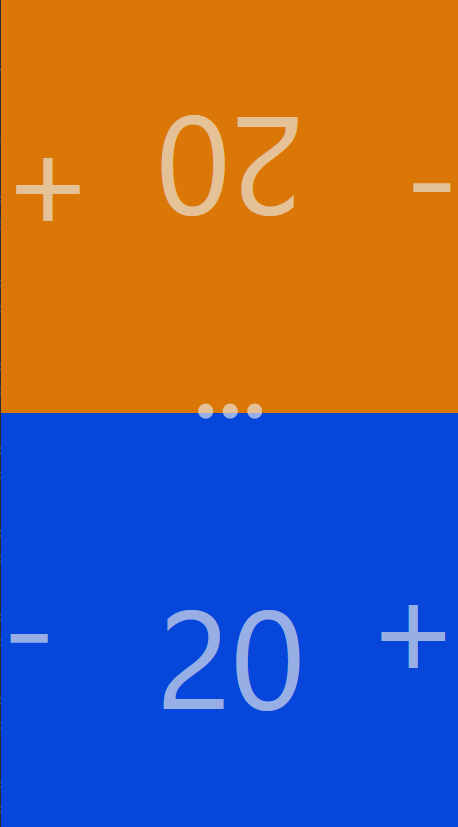

# GameLiveCounter

Is a basic live counter for games,
it can handle two person at the same time.

You can use the setting menu to switch to fullscreen,
also when android with chromebase browser is used,
you can also disable the screensaver (enable wakelock).



## Requirments

Only a webserver to deliver the js files is needed,
the website runs full on client side.

## Project Setup

```sh
npm install
```

### Compile and Hot-Reload for Development

```sh
npm run dev
```

### Type-Check, Compile and Minify for Production

```sh
npm run build
```

### Run Unit Tests with [Vitest](https://vitest.dev/)

```sh
npm run test:unit
```
